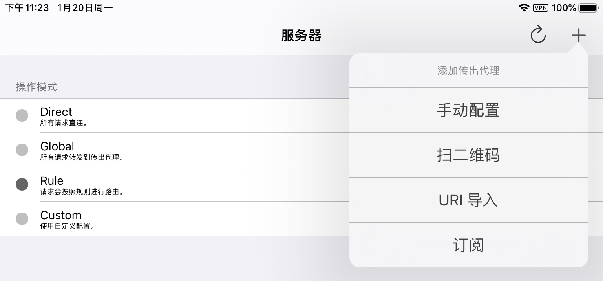
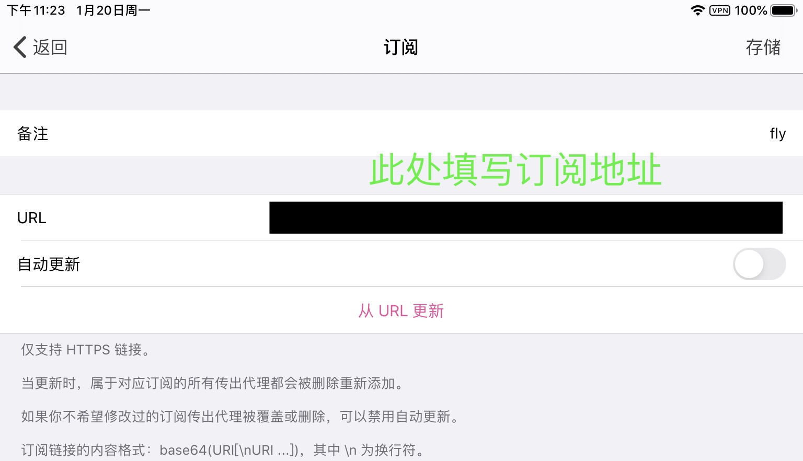
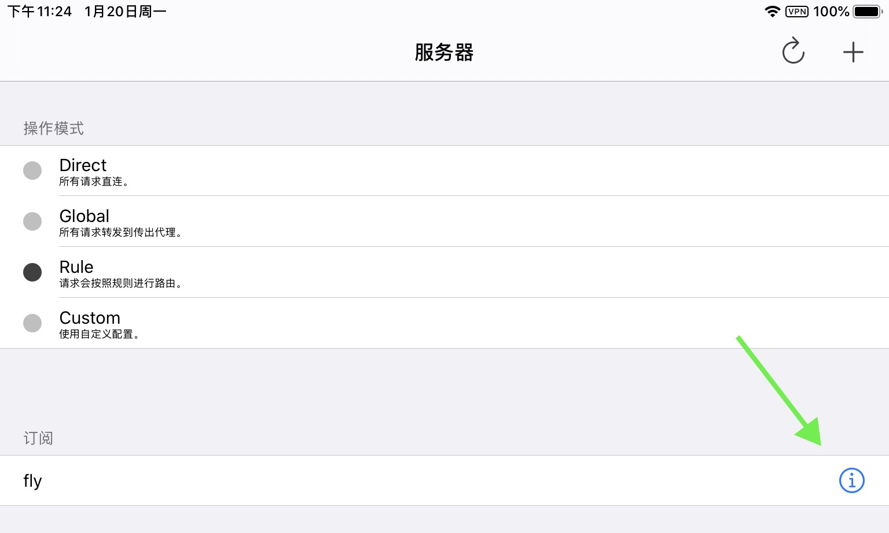
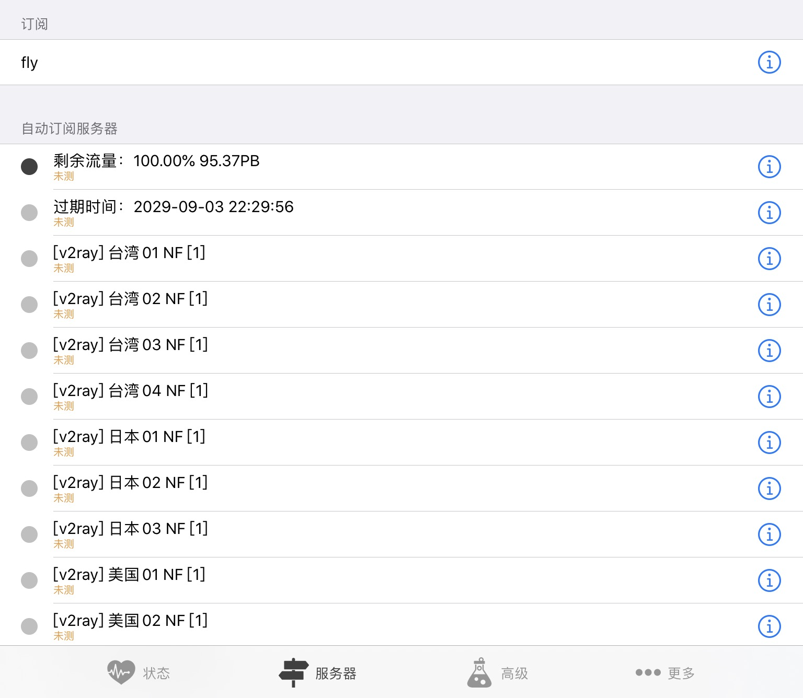

简介
--
Kitsunebi 是一个基于 V2Ray 核心的 iOS 应用。它可以创建基于 VMess 或者 Shadowsocks, SOCKS 的 VPN 连接。Kitsunebi 支持导入和导出与 V2Ray 兼容的 JSON 配置。

由于使用 V2Ray 核心，Kitsunebi 几乎支持 V2Ray 的所有功能，比如 Mux 和 mKCP。  

 

下载安装
----

请在非中国大陆区 AppStore 购买下载。需要自备外区AppleID
[appstore地址](https://apps.apple.com/us/app/kitsunebi-proxy-utility/id1446584073)  

 

声明
----
1.文档中的某些内容可能随时间变化而失效。
2.请自行确认手持的机场订阅链接是否支持此软件。   

 

Kitsunebi配置
---

**1.添加服务器（节点）**  

[(1)打开 Kitsunebi ，点击底部的“服务器”，再点击右上角加号，可以看到，该软件支持四种导入方式：]()

>   - 手动配置
>   - 扫二维码
>   - URI导入（即复制粘贴单条节点链接，如vmess://xxxx）
>   - 订阅

这里只讨论最简单的办法——订阅。
首先请复制好自己的订阅链接。
然后打开软件，点击底部的“服务器”，点击右上角加号，点击“订阅”。  

  

[(2)然后打开软件，点击底部的“服务器”，点击右上角加号，点击“订阅”。然后粘贴自己的订阅地址到 URL 那一栏，备注可以随便写。自动更新选项可以打开。  ]()

  

[(3)填写完毕后请勿直接点击“从URL更新”，而是要先点击“存储”，再回到“服务器”页面，然后点击“订阅”后边的 i 按钮，然后再点击 “从URL更新”。]()

  

[(4)此时节点信息就会出现在“服务器”页面。如图：  ]()

